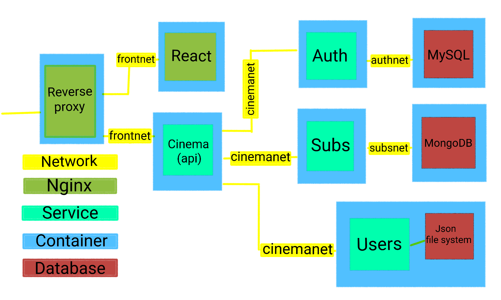

## Cinema Movies & Subscription managment


This web app are for study purposes

---

### Build:

Admin credentials are set to: <br/>
username: `zin`  <br/>
password: `12345` <br/>

#### Prerequisites:
    - docker
    - docker-comopse

#### Installation:

To run this app on local environment switch and clone
the development branch and run the commands below:

```bash
# verify docker.socket are active
$ sudo systemctl status docker.socket

# if not active run
$ sudo systemctl start docker

# navigate to docker-compose directory
$ cd docker-compose && sudo docker-compose up --build

# navigate to localhost on your browser
```

---

## App Design:
 

